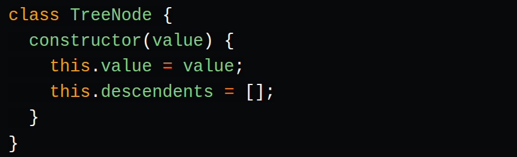
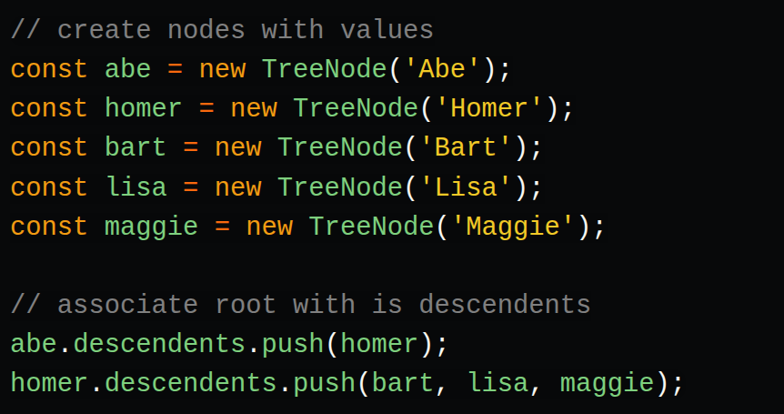

https://dev.to/amejiarosario/tree-data-structures-explained-with-javascript-1d7d

## Tree Data Structures Explained with JavaScript

Tree data structures have many uses, and it's good to have a basic understanding of how they work. Trees are the basis for other very used data structures like Maps and Sets. Also, they are used on databases to perform quick searches. The HTML DOM uses a tree data structure to represents the hierarchy of elements. In this post, we are going to explore the different types of trees like a binary tree, binary search trees, and how to implement them.

### Trees: basic concepts
A tree is a data structure where a node can zero or more children. Each node contains a value. Like graphs, the connection between nodes is called edges. A tree is a type of graph, but not all of them are trees (more on that later).

These data structures are called "trees" because the data structure resembles a tree 🌳. It starts with a root node and branch off with its descendants, and finally, there are leaves.

#### Here are some properties of trees:

* The top-most node is called root.
* A node without children is called leaf node or terminal node.
* Height (h) of the tree is the distance (edge count) between the farthest leaf to the root.
    * A has a height of 3
    * I has a height of 0
* Depth or level of a node is the distance between the root and the node in question.
    * H has a depth of 2
    * B has a depth of 1

### Implementing a simple tree data structure

As we saw earlier, a tree node is just a data structure that has a value and has links to their descendants.

Here's an example of a tree node:

We can create a tree with 3 descendents as follows:

That's all; we have a tree data structure!

The node abe is the root and bart, lisa and maggie are the leaf nodes of the tree. Notice that the tree's node can have a different number of descendants: 0, 1, 3, or any other value.

Tree data structures have many applications such as:

* Maps
* Sets
* Databases
* Priority Queues
* Querying an LDAP (Lightweight Directory Access Protocol)
* Representing the Document Object Model (DOM) for HTML on the Websites.
* 