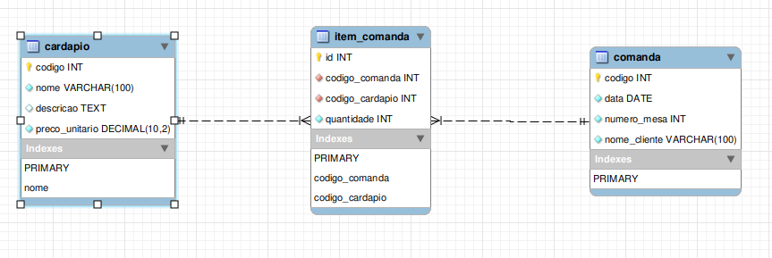
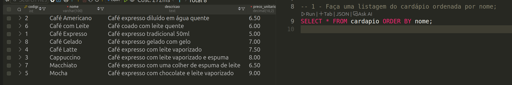
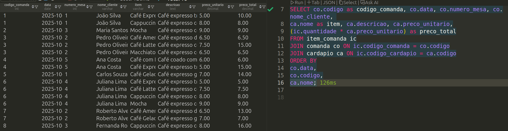
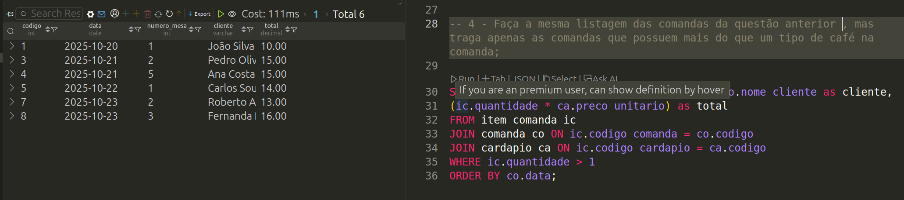
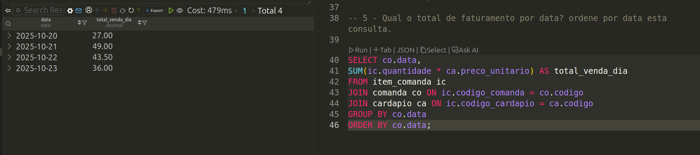

# Atividade 08 - Modelando, Construindo e Pesquisando


## Sobre...
A cafeteria **BomGosto** deseja controlar as suas vendas de café. A BomGosto controla suas vendas a partir de uma comanda. Uma comanda tem um código único, data, o número da mesa do cliente e o nome do cliente registrados. Nos itens da comanda é possível relacionar vários cafés listados no cardápio que foram vendidos. Cada item da comanda possui o código do cardápio e a quantidade requisitada deste e, não é possível inserir o mesmo código de cardápio mais de uma vez na mesma comanda. No cardápio é apresentado o nome único do café, a descrição da sua composição e o preço unitário.

Desenvolva os scripts SQL para atender cada uma das questões abaixo:

1) Faça uma listagem do cardápio ordenada por nome;

2) Apresente todas as comandas (código, data, mesa e nome do cliente) e os itens da comanda (código comanda, nome do café, descricão, quantidade, preço unitário e preço total do café) destas ordenados data e código da comanda e, também o nome do café;

3) Liste todas as comandas (código, data, mesa e nome do cliente) mais uma coluna com o valor total da comanda. Ordene por data esta listagem;

4) Faça a mesma listagem das comandas da questão anterior (6), mas traga apenas as comandas que possuem mais do que um tipo de café na comanda;

5) Qual o total de faturamento por data? ordene por data esta consulta.

## Os Dados


## UML das tabelas propostas




## As respostas

### MySQL
1. Faça uma listagem do cardápio ordenada por nome;

```SQL
-- Query SQL
SELECT * FROM cardapio ORDER BY nome;
```

### Resultado


```SQL
-- Query SQL
SELECT co.codigo as codigo_comanda, co.data, co.numero_mesa, co.nome_cliente, 
ca.nome as item, ca.descricao, ca.preco_unitario,
(ic.quantidade * ca.preco_unitario) as preco_total
FROM item_comanda ic
JOIN comanda co ON ic.codigo_comanda = co.codigo
JOIN cardapio ca ON ic.codigo_cardapio = ca.codigo
ORDER BY
co.data,
co.codigo,
ca.nome;
```

2. Apresente todas as comandas (código, data, mesa e nome do cliente) e os itens da comanda (código comanda, nome do café, descricão, quantidade, preço unitário e preço total do café) destas ordenados data e código da comanda e, também o nome do café;

```SQL 
SELECT co.codigo as codigo_comanda, co.data, co.numero_mesa, co.nome_cliente, 
ca.nome as item, ca.descricao, ca.preco_unitario,
(ic.quantidade * ca.preco_unitario) as preco_total
FROM item_comanda ic
JOIN comanda co ON ic.codigo_comanda = co.codigo
JOIN cardapio ca ON ic.codigo_cardapio = ca.codigo
ORDER BY
co.data,
co.codigo,
ca.nome;
```



3. Liste todas as comandas (código, data, mesa e nome do cliente) mais uma coluna com o valor total da comanda. Ordene por data esta listagem;

```SQL
SELECT co.codigo, co.data, co.numero_mesa, co.nome_cliente as cliente,
(ic.quantidade * ca.preco_unitario) as total
FROM item_comanda ic
JOIN comanda co ON ic.codigo_comanda = co.codigo
JOIN cardapio ca ON ic.codigo_cardapio = ca.codigo
ORDER BY co.data;
```


4. Faça a mesma listagem das comandas da questão anterior (6), mas traga apenas as comandas que possuem mais do que um tipo de café na comanda;
```SQL
SELECT co.codigo, co.data, co.numero_mesa, co.nome_cliente as cliente,
(ic.quantidade * ca.preco_unitario) as total
FROM item_comanda ic
JOIN comanda co ON ic.codigo_comanda = co.codigo
JOIN cardapio ca ON ic.codigo_cardapio = ca.codigo
WHERE ic.quantidade > 1
ORDER BY co.data;
```




5. Qual o total de faturamento por data? ordene por data esta consulta.

```SQL
SELECT co.data, 
SUM(ic.quantidade * ca.preco_unitario) AS total_venda_dia
FROM item_comanda ic
JOIN comanda co ON ic.codigo_comanda = co.codigo
JOIN cardapio ca ON ic.codigo_cardapio = ca.codigo
GROUP BY co.data
ORDER BY co.data;
```
